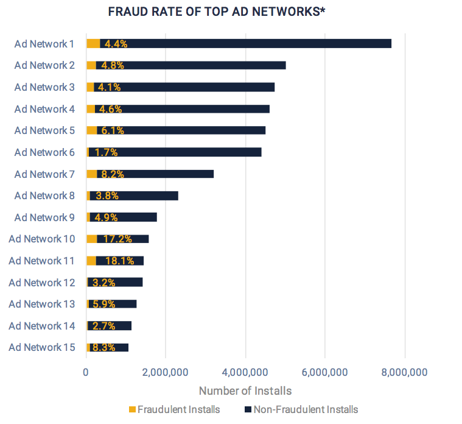

# Machine Learning Engineer Nanodegree
## Capstone Proposal
## TalkingData AdTracking Fraud Detection Challenge
Camila Barbosa  
January 24st, 2020

## Proposal

### Domain Background
Nowadays, fraud traffic is one of the most pressing matters coupled with the exponentially growing mobile phone use. With the number of smart devices approaching 2 billion worldwide, frauds in the mobile app ecosystem are more and more rampant.

Fraud risk is everywhere, but for companies that advertise online, click fraud can happen at an overwhelming volume, resulting in misleading click data and wasted money. Ad channels can drive up costs by simply clicking on the ad at a large scale. With over 1 billion smart mobile devices in active use every month, China is the largest mobile market in the world and therefore suffers from huge volumes of fradulent traffic.

_Source: [DataVisor](https://www.datavisor.com/)_

It is shown that fraudulent apps led to at least 15% of the total amount of apps downloaded and installed on smartphones in 2017. In 2016, $5.7 billion dollars were spent on mobile advertising in the US alone; these numbers tell us that fraudsters are making away with hundreds of millions from developers and businesses each year. Clearly, mobile frauds are a severe financial burden and a serious threat to the mobile industry.

### Problem Statement

[Talking Data](https://www.talkingdata.com/) is one of the most prominent big data platform, covering more than 70% of mobile devices' activities across China. They handle billions of ads clicks on mobile per day that are potentially fraudulent. Their current strategy against mass-install factories and fake click producers is to build a portfolio for each IP address and device based on the behavior of the click, flagging those who produce lots of clicks but never end up installing apps.

In their [Kaggle competition](https://www.kaggle.com/c/talkingdata-adtracking-fraud-detection), Talking Data provided a dataset detailing the clicks registered by their system; the goal is to build a model that predicts whether an user will download an app after clicking a mobile app or not. This model would help the firm increase their solution's accuracy in identifying fraudsters.

### Datasets and Inputs

The dataset provided by Talking Data on [Kaggle competition homepage](https://www.kaggle.com/c/talkingdata-adtracking-fraud-detection) includes approximately 200 million registered clicks over 4 days, split into training and testing sets. The training set contains more than 180 million rows of data, each has the timestamp of the click, number-encoded IP addresses, device numbered label code, device's operating system code, app code, channel code, whether the click resulted in a download or not, and time of download if applicable. The testing set contains about 18 million clicks with each click associated with an ID and other information excluding the download or not label and download time.

### Solution Statement

The solution is a classification model capable of predicting whether a click with known attributes would result in the respective app being downloaded to the device or not. First, I will use Pandas and Numpy to gain some understanding of the data, then try to devise some new features based on the given features to train on. As for model, I am inclined towards XGBoost, a powerful Gradient Boosting framework that has proven itself in many past Kaggle competitions while being versatile and work with other frameworks such as scikit-learn.

### Benchmark Model

Randomly predicting with equal probability that whether or not a click results in a download with absolute certainty yields a ROC-AUC score of 0.3893 on the test dataset.

### Evaluation Metrics

A model in this competition is graded based on the area-under-the-ROC-curve score between the predicted class probability and the observed target, measured on the test data. Since the test data is not labelled, grading is done by uploading the file containing the download probability of each click in the test data to Kaggle.

### Project Design

* **Programming language:** Python 3.6
* **Library:** Pandas, Numpy, Scikit-learn, XGBoost
* **Workflow:**
  * Establish basic statistics and understanding of the dataset; perform basic cleaning and processing if needed.
  * Train a base classification model on the given data as-is to gauge the performance.
  * Devise new features based on the given features; some intuitions: what day of the week the click was registered, what time of day, is it a holiday or is there any social event going on, how often a specific user or IP address invokes a click, etc.
  * Fine tune the model's hyperparameters.
  * Perform training.

### Prospects
  
The sheer size of the given data (over 180 million rows of data, ~7.3GB) will no doubt pose a challenge to both the data processing and training steps. Having to upload the test prediction in order to assess performance at every round will also be a hurdle since the process will take a lot of time.

### References
- https://www.kaggle.com/c/talkingdata-adtracking-fraud-detection/overview
- https://www.talkingdata.com/
